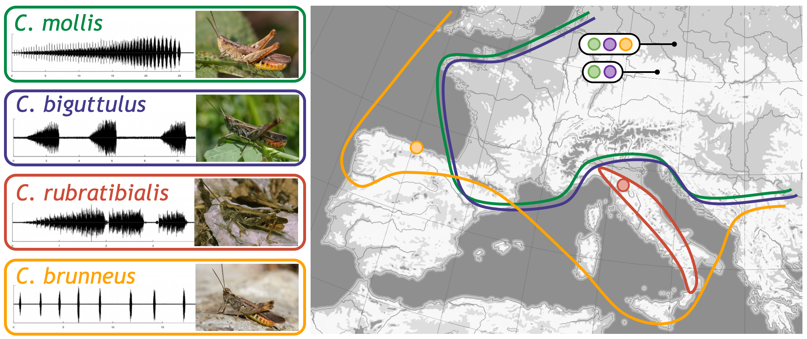

# Historical isolation facilitates species radiation by sexual selection: Insights from *Chorthippus* grasshoppers

Zachary J. Nolen, Burcin Yildirim, Iker Irisarri, Shanlin Liu, Clara Groot Crego, Daniel Buchvaldt Amby, Frieder Mayer, M. Thomas P. Gilbert, Ricardo J. Pereira

  
  
	
	

This page serves as a central documentation for the manuscript listed above. For questions relating to the methods in this manuscript or the files in the repository please contact Zachary J. Nolen or Ricardo J. Pereira. Feel free to post questions in the issues section of the repository and we can make updates in accordance with the needs of those using it. Thank you for your interest in our work!
