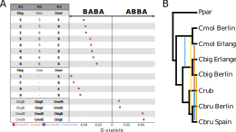
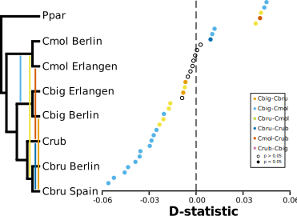

# ABBA-BABA Test

The ABBA-BABA test is a tool for measuring introgression between related populations. This is done by comparing four populations with the relationship (((H1,H2),H3),H4), with H4 being the outgroup. It samples biallelic sites, determining one allele as ancestral (using the outgroup), notated as A, and the other as derived, noted as B.

Should the gene tree match the species tree, we would expect the derived at H1 and H2, and the ancestral at H3 and H4, or a layout of BBAA. However, should the gene tree not follow the species tree, we may see the layouts ABBA or BABA. If these layouts are simply due to incomplete lineage sorting, then we should see them in similar proportions across the genome. But, if we see one more often than the other it can suggest gene flow between two of the branches.

The test uses Patterson's D-statistic to describe these proportions. Should the proportion of ABBA and BABA sites be roughly equal, the D-statistic will be around 0. However, should there be more ABBA sites (gene flow between H2 and H3), it will be positive, and if there are more BABA sites (gene flow between H1 and H3), it will be negative.


[(Heliconius Genome Consortium 2012)](https://doi.org/10.1038/nature11041)

## doAbbababa2 in ANGSD

ANGSD is a command line population genetics software that incorporates an implementation of the ABBA-BABA test. The newer version of this implementation, [doAbbababa2](http://www.popgen.dk/angsd/index.php/Abbababa2), is unique in that it allows multiple individuals to be used per population. It does this by running the analysis repeatedly: assigning populations to the tip, and running the test with all possible combination of individuals for each population. It then summarizes the result for each population topology by using a weighted sum of all individual tests.

### Prepping your data

There are four main input files.

Bamlist - A list of all the bam files you will be using in the analysis with absolute filepaths for the server you are working on. They should be ordered by population with the outgroup as the last and not have a blank line at the end.

Reference genome - The reference. We used the *Pseudochorthippus* reference transcriptome found in the [Dryad](https://doi.org/10.5061/dryad.pzgmsbchj), filename - `grasshopperRef.fasta`.

Neutral sites file - The list of neutral sites in the genome, found in the [Dryad](https://doi.org/10.5061/dryad.pzgmsbchj), filename - `neutral_sites`.

Size file - This tells ANGSD how to group your populations, it should be a list of numbers, each one stating how many individuals are in each population, including the outgroup. See the [pop_all.size](https://github.com/zjnolen/chorthippus_radiation/blob/master/ABBA_BABA/pop_all.size) file as an example.

### Running on the cluster through SLURM

This task uses a lot of memory and should be submitted to a cluster where this is available. This header works well for this job type:

```bash
#!/bin/bash
#SBATCH -J pop_miss20
#SBATCH --clusters=hugemem
#SBATCH --partition=hugemem_std
#SBATCH --cpus-per-task=10
#SBATCH --mem=200000mb
#SBATCH -t 100:00:00
```

You can change the job name to match your own, include any variables you will be changing in the job name and output for identification.

Example:

```bash
angsd -b ../input_files/lrz_all.bamlist -ref ../input_files/grasshopperRef.fasta -doMajorMinor 1 \
-GL 1 -doMaf 1 -doCounts 1 -doAbbababa2 1 -sizeFile pop_all.size -useLast 1 \
-r chr1: -sites ../input_files/neutral_sites -baq 1 -remove_bads 1 -uniqueOnly 1 \
-C 50 -minMapQ 15 -only_proper_pairs 0 -minQ 20 -minInd 67 -setMinDepth 168 \
-SNP_pval 1e-6 -out output/pop_miss20
```

Many of these options are explained in [General ANGSD Options](angsd.md#general-options), any additional options or ones deviating from standard options are explained below:


Option							|Description
--------------------------------|----------------------------------------------------
`-doAbbababa2 1`				|This is the point at which we instruct ANGSD to do the ABBA BABA test. The 2 in the option name refers to the newest implementation of the test which allows multiple individuals to be used per population in the analysis.
`-blockSize [Int]`				|Did not specify, leaving at default value of 5000000.
`-sizeFile sizefile.size`		|This option points to the location of a sizefile, which ANGSD uses to divide up the bamlist into populations.
`-useLast 1`					|Instructs ANGSD to use the last population in the bamlist as our outgroup.
`-SNP_pval 1e-6`				|Discards SNPs with a p-value of greater than 1e-6. This largely filters out fixed sites and low frequency SNPs. For ABBA-BABA, this is an appropriate filter as low frequency SNPs will largely be singletons, which are not beneficial for inferring ancestral gene flow and reduces computation time.

### Output files

The test will output three files, `output_name.abbababa2`, `output_name.arg`, and `output_name.mafs.gz`. We will only use the first. This contains the raw data that the D-statistic will be calculated from. This is done with an R script `estAvgError.R` provided by ANGSD. You can run this from the command line:

```bash
Rscript estAvgError.R angsdFile="[.abbababa2file]" out="[nameofoutput]" nameFile=popNames.name
```

Here, the `.abbababa2` file will be one input (leave off the extension when defining it) along with a name for your output file, and a name file. The name file should be created before running, and is a list of the names of all your populations. It should be the same length as the size file. [Example](https://github.com/zjnolen/chorthippus_radiation/blob/master/ABBA_BABA/popNames.name).

This will produce two .txt files, one with the observed D-statistics and one with ancestral transitions removed. We only need the observed file as the transrem file is used for ancient DNA samples.

#### Trimming the output
The output contains all possible combinations of populations for the four population test. However, the ABBA-BABA test has the assumption that the reconstructed tree that will be tested matches the species tree. We've made an [R script](https://github.com/zjnolen/chorthippus_radiation/blob/master/ABBA_BABA/trim_abba_baba.R) that trims out all topologies that don't match the species tree, and outputs the remainder as a csv. It can be run from bash with the following command:

```bash
Rscript trim_abba_baba.R [D-statistics txt file with extension]
```

This has the population level tree topologies built in for *Chorthippus*. Check the R file to confirm the topologies are correct before running.

This csv will be the final output data, with all the D-statistics, topologies, p-values, and Z-scores for analysis. Entries with a significant p-value suggest evidence for ancient gene flow between two populations. If the D-statistic is positive, the gene flow is between H2 and H3, if it is negative, the gene flow is between H1 and H3.

Below are the results of our ABBA BABA analysis as depicted in Figure 5 and S12:






References
==============

Dasmahapatra, Kanchon K., James R. Walters, Adriana D. Briscoe, John W. Davey, Annabel Whibley, Nicola J. Nadeau, Aleksey V. Zimin et al. "Butterfly genome reveals promiscuous exchange of mimicry adaptations among species." Nature 487, no. 7405 (2012): 94. doi: [10.1038/nature11041](https://doi.org/10.1038/nature11041).

-------------

<div style="text-align: right">Page last updated on {docsify-updated}</div>
