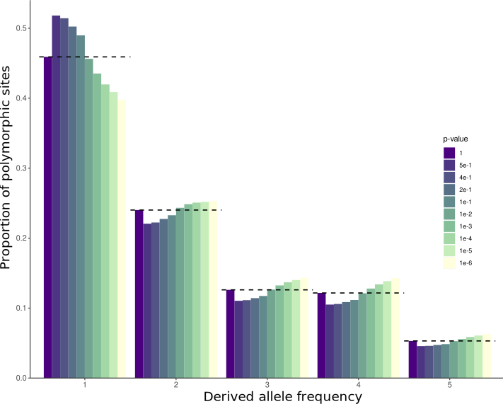

# Notes on ANGSD

During this project, ANGSD was used for several population genetic analyses, below we categorize a few notes on options and methods that were common to all analyses using ANGSD unless otherwise mentioned.

## Bamlist

Bamlists provide the input bam files for an analysis. They should have the full file path and no blank line at the end. We had bamlists containing all individuals, and ones containing only individuals in a single population, and would use the list needed for each analysis. As these are simply lists of file locations, they are not uploaded here.

## Neutral Sites

Demographic analyses rely on the sites involved being neutral, as they are not influenced directly by selection and will exhibit demographic processes most directly. To use our data for demographic analyses, we limited all relevant analyses to 'neutral sites', in this case, the neutral sites are the untranslated regions (UTRs) of each gene and the third base of every codon, as changes in these sites are synonymous and do not change the function of the genes. These sites are listed in the `neutral_sites` file available in the [Dryad](https://doi.org/10.5061/dryad.pzgmsbchj) and is fed into every relevant analysis.

## General Options

There are many options that can be fed to ANGSD during analyses, many for filtering the data you will be analyzing. Below, we list the major ones used in almost all analyses.

Option							|Description
--------------------------------|----------------------------------------------------
`-b lrz_all.bamlist`			|Specifies the location of the bamlist to be used in the command. Here it is named 'lrz_all.bamlist', representing a bamlist of all individuals stored on the LRZ cluster.
`-ref grasshopperRef.fasta`		|This option points to the location of the reference genome. Here we use the *P. parallelus* reference transcriptome, available in the [Dryad](https://doi.org/10.5061/dryad.pzgmsbchj).
`-doMajorMinor 1`				|Many analyses assume sites are biallelic, with one classified as the major allele and one the minor. Using '1', we tell ANGSD to use genotype likelihoods to classify the alleles at each site as 'major' or 'minor'. [Source](http://www.popgen.dk/angsd/index.php/Major_Minor)
`-GL 1`							|Calculates the likelihood of observing our data in one individual at one site given a certain genotype in that individual at that site. These are very important for filtering next generation sequencing data with varying or low coverage, as it provides a more robust method compared to SNP calling by taking in to account possible errors in sequencing, alignment, and SNP calling. These error calculations are especially important for transcriptome analysis, as coverage is variable and based on expression (a gene that is expressed more often will have greater coverage on average). Using '1' for this option selects the SAMTools implementation of genotype likelihoods. [Source](http://www.popgen.dk/angsd/index.php/Genotype_Likelihoods)
`-doMaf 1`						|Calculates the frequency of the major and minor alleles. Using '1' we use 'known' alleles for both the major and minor alleles, these alleles were classified when we used the '-doMajorMinor 1' option. Allele frequency is calculated using genotype likelihoods. [Source](http://www.popgen.dk/angsd/index.php/Allele_Frequencies)
`-doCounts 1`					|Calculates the frequency of each base per sample per site. [Source](http://www.popgen.dk/angsd/index.php/Allele_Counts)
`-r chr1:`						|Restricts the analysis to sites on chromosome 1 of the reference genome. We do this because the chromosomes specified in our transcriptome data are not actually chromosomes, but artificial containers for the data. Four artificial chromosomes were built from *P. parallelus* male NGS data, the first containing all single copy genes.   Note: Though we may have used the '-sites' option to restrict the analysis to chromosome 1 as our sites file only has sites in chromosome 1, it is beneficial to computation time to restrict the analysis here as well. This prevents other calculations (genotype likelihoods, etc.) from being done on the other chromosomes that won't be analyzed.
`-sites neutral_sites`			|Points to a file containing specific sites to restrict the analysis to. Here we use a file of neutrally evolving sites so that demographic analyses are not biased by sites under selection.
`-baq 1`						|Performs the Base Alignment Quality (BAQ) analysis in SAMTools, this provides a probability for bases being misaligned, which can be used to reduce false positives for SNPs that are actually just misalignments.
`-remove_bads 1`				|Filters sites that contain SAMTools flags greater than 255. These sites are poor alignments, duplicate reads, etc.
`-uniqueOnly 1`					|Removes reads that have more than one best hit (places in the genome where the read aligns).
`-C 50`							|A coefficient that reduces the mapping quality score of a read based on the probability of sites being misaligned as per BAQ. Using '-C 50' can reduce reliance on reads that are of poor mapping quality.
`-minMapQ 15`					|Removes reads that have low mapping quality. The scale is logarithmic, and a value of 20 represents a probability of ~ 3 in 100 for a mapping mismatch.
`-only_proper_pairs 0`			|Removes reads that are not paired. We set this to '0' as our reads are collapsed, so they contain one long read of data, rather than paired end data.
`-minQ 20`						|Removes reads that have a low base read quality. The scale is logarithmic, and a value of 20 represents a probability of 1 in 100 for an incorrect base call.
`-minInd 67`					|Removes sites that are not present in a minimum number of individuals. We allow 20% missing data, or 67/84 individuals. This value will vary depending on the number of individuals in each analysis.
`-setMinDepth 168`				|Removes sites below a minimum number of reads in the entire pool of individuals (coverage). Here, we set it to 2 times the number of individuals, as we want on average at least one read per allele, and there are two alleles per individual. This value will vary depending on the number of individuals in the analysis.
`-SNP_pval 1e-2`				|Discards SNPs with a p-value of greater than 1e-2. This largely filters out fixed sites and low frequency SNPs. This setting is used only in some analyses that should not be performed when including fixed sites.
`-out output/output_file_name`	|Sets a name and location for the analysis output files.

## SNP_pval

In most analyses, we used a `-SNP_pval` of 1e-2, which we determined by examining what value least distorted the SFS:

