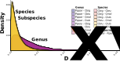

# Dxy

Calculation of Dxy was done in R with the [`Dxy_popgenome.R`](https://github.com/zjnolen/chorthippus_radiation/blob/master/dxy/Dxy_popgenome.R) script here, which utilizes the PopGenome package. This script requires the per gene alignments created for building individual gene trees. The methods for this can be found in the [Phylogenetics section of this repo](phylogenetics.md/#creating-alignments).

Below are the distribution of gene Dxy values for the populations in our study, as presented in Figure 4:

-------------

Page last updated on {docsify-updated}

