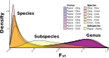

Fst
==================

We calculate Fst using three scripts: [calc\_glob\_fst.sh](https://github.com/zjnolen/chorthippus_radiation/blob/master/fst/calc_glob_fst.sh), [calc\_gene\_fst.sh](https://github.com/zjnolen/chorthippus_radiation/blob/master/fst/calc_gene_fst.sh), and [calc\_site\_fst.sh](https://github.com/zjnolen/chorthippus_radiation/blob/master/fst/calc_site_fst.sh) to calculate global, per gene, and per site Fsts respectively. To calculate site and gene Fst, global Fst must first be calculated, which requires saf files for each population (described in the [sfs section of this repository](sfs.md#creating-saf-files)). The per gene Fst calculations require the script [loopFst.pl](https://github.com/zjnolen/chorthippus_radiation/blob/master/fst/loopFst.pl) which is specifically written for our grasshopper system. Outputs for these are available upon request, only per gene Fsts have been pushed to this repository. These analyses were performed for relevant population pairs, and summarized into the per gene Fst distribution plot in the paper (Figure 4b) and pictured here:

-------------

Page last updated on {docsify-updated}

