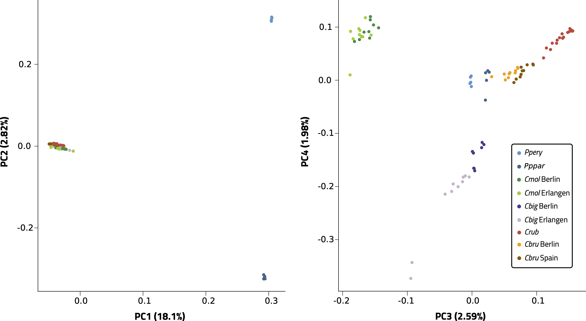

# Principal Component Analysis

The Principal Component Analysis is produced from a Beagle genotype likelihood file of the entire dataset to run the analysis on. Beagle file production is described [here](ngsadmix.md#input-files-making-a-beagle-file). The PCA requires the making of a covariance table, which contains all principal components and their relative contributions to the variance in the dataset, and a PLINK cluster file to divide your samples into their respective groups. The analysis consists thus of three steps: making the covariance table, making the PLINK cluster file, and plotting the different principal components.


## Making a Covariance Table

First thing to do, is to unzip the .geno file that was created along with your Beagle file.

```bash
gunzip [nameofgenofile].geno.gz
```

Now, we can access the file from which we'll make the covariance table. Additionally, we need to count the amount of variable sites in our dataset, as we'll need this number for making the table in the following step. The count is done from the allele frequencies in the .mafs file:

```bash
N_SITES=`zcat [nameofmafsfile].mafs.gz | tail -n+2 | wc -l`
echo $N_SITES
```

Finally, we can make the covariance table. This is done from the .geno file with the program ngsCovar that is part of the module [ngsPopgen](https://github.com/mfumagalli/ngsPopGen). The table is made like this:

```bash
ngsCovar -probfile [yourgenofile].geno # Specifies the input file
-outfile [yourcovtable].covar # Gives a name to the covariance table
-nind 80 # Specifies the number of individuals in the dataset
-nsites 804788 # Specifies the number of variable sites obtained in previous step
-call 0
-norm 0
```

In our case, the covariance table are available in the [Dryad](https://datadryad.org/stash/dataset/doi:10.5061/dryad.pzgmsbchj?).

## Making a PLINK cluster file

The covariance table doesn't assign any datapoints to a specific group in the dataset. To specify these groups (they are usually populations), you need to make a PLINK cluster file. Such a file can be made very quickly with the following R command:

```bash
Rscript -e 'write.table(cbind(seq(1,84), rep(1,84), \
c(rep("Cbig_B",8),rep("Cbig_E",10),rep("Cbru_B",10), rep("Cbru_S",10), \
rep("Cmol_B",10),rep("Cmol_E",10),rep("Crub",16), \
rep("Cpery",5),rep("Cppar",5))), \
row.names=F,col.names=c("FID","IID","CLUSTER"),\
sep="\t",file="plink_all84.clst",quote=F)'
```

In this specific example, we specify that there are 84 individuals in our dataset, of which 8 and 10 belong to *C. biguttulus* in Berlin and Erlangen, 10 and 10 belong to *C. brunneus* in Berlin and Spain, 10 and 10 belong to *C. mollis* in Berlin and Erlangen, 16 belong to *C. rubratibialis*, 5 belong to *P. p. erythropus*, and 5 belong to *P. p. parallelus*. The order in which you mention each group and the amount of individuals it contains has to match the order of the bamlist, so that the program assigns labels to the correct data points. The clst file for our data is available in the [Dryad](https://datadryad.org/stash/dataset/doi:10.5061/dryad.pzgmsbchj?)

## Making a PCA plot

Now that we have our covariance table and cluster file we can plot the results of the PCA. We can do this by using the R script that comes with NgsPopgen:

```bash
Rscript $NGSTOOLS/scripts/plotPCA.R # Path to the Rscript
-i [nameofyourcovtable].covar # Specifies the covariance table
-c 1-2 # Specifies which principal components will be plotted (in this case PC1 and PC2).
-a [nameofplinkfile].clst # Specifies the PLINK cluster file
-o [nameofPCAplot].pdf # Gives a name to the output
```

Below are the plots of PC1,2,3, and 4 for our data as presented in Figure S9:


