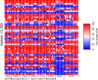

# Gene Alignments

## Fasta file creation

We first converted the BAM files to FASTA files with the -doFasta function of ANGSD. The command is as follows:

```bash
angsd \
-i $individual.bam -ref grasshopperRef -r chr1: \
-remove_bads 1 -uniqueOnly 1 -baq 1 -C 50 -minMapQ 15 \
-only_proper_pairs 0 -minQ 15 -doCounts 1 -setMinDepth 10 \
-doDepth 1 -doFasta 2 -out individual_genome_minD10
```

Most of the options here are explained in [General ANGSD Options](angsd.md#general-options). The most important options here is `-doFasta 2`, which specifies that the most common base will be called and `setMinDepth 10`, which determines the minimum coverage for a base to be sampled.

## Creating Alignments

We created alignments per gene, first extracting each gene into a separate FASTA file using the positions info file. To do this, we first convert the positions file into BED format.

### Converting the position info file into BED file format

The structure of the position file (available in the [Dryad](https://datadryad.org/stash/dataset/doi:10.5061/dryad.pzgmsbchj)) is the following:

```
catalog_normal_noMito.fasta:cluster_6	chr1:1-9898
catalog_normal_noMito.fasta:cluster_8	chr1:10399-14520
catalog_normal_noMito.fasta:cluster_19	chr1:15021-17109
catalog_normal_noMito.fasta:cluster_21	chr1:17610-21014   
```

The BED file should be tab separated containing the chromosome number, start, and end positions of the genes in the first three columns, respectively. Optionally, gene IDs can be added to a fourth column. Most importantly, the BED file is zero-based unlike our position file which is 1-based. That's why we manipulated the position info file for our needs with the following commands:

```bash
awk '{sub(/\:/," ",$2)};1' grasshopperRef.positions > $output1
awk '{sub(/\-/,” ",$3)};1' $output1 > $output2
awk '{print $2, $3,$4, $1}' $output2 > $output3
```

These commands separate the chromosome, start, and end position info, which are given together in the
second column of the position file, and reorders them as defined in the BED file format.

```bash
awk '{$2=$2-1; print $0}' $output3 > $output4
```

This command converts our 1-base position file into 0-base by subtracting 1 from each start positions.

```bash
cat $output4 | grep “chr1” > $output5
```

This command extracts only chromosome 1 from the file. The final output from these had redundant characters in the geneID column. However, we just wanted to know the cluster IDs, which are our gene IDs, so we organized them with the following commands:

```bash
awk '{sub(/\:/,” ",$4)};1' $output5 > $output6
awk '{print $1,$2,$3,$5}' $output6 > $output7
tr " " "\t" < $output7 > grasshopperRef.positions_onlyChr1.bed
```

This first deletes the text before the cluster IDs in column 4 and then reorders the columns. The final line converts the whitespace delimiter to tab and creates the final BED file.

### Separating the genes in each FASTA file

Using the BED file and BEDtools we separated the genes in each individual's FASTA file:

```bash
bedtools getfasta -fi $individual.fa -name -bed grasshopperRef.positions_onlyChr1.bed \
-fo ${individual}_genesepORF.fa
```

This command does not extract FASTA files for each gene, but rather separates them inside the main FASTA file of each individual by giving headers to the genes. The `-name` option puts the information in the BED file (chromosome, start-end, gene ID) into the header.

We changed the header by adding the individual names, so that they would be identifiable in the final alignment:

```bash
sed 's/^\(>.*\)$/\1' $individual.fa > ${individual}_minD10_genesepORF_hc.fa
```

### Creating a FASTA file for each gene

After giving each gene its own header we extracted them into separate files with the following command:

```bash
while read line; do
	if [[ ${line:0:1} == '>' ]]; then
		outfile=${line#>}.fa
		echo $line > $outfile
	else
		echo $line >> $outfile
	fi
done < ${individual}_md10_genesepORF_hc.fa
```

### Combining the same genes from each individual to create alignments

#### Filtering

To exclude the genes with too much missing data, we needed to calculate the percentages of Ns in each gene and for each individual. This was done with the following commands:

```bash
while read line ; do
	grep -o "N" $line::chr1_${individual}_md10.fa | wc -w >> numberofNs_$individual
	awk '{print length($1)}' $line::chr1_${individual}_md10.fa | sed -n 2p >> length_$individual
done < $geneIDs

paste numberofNs_$individual length_$individual > stat_$individual
```

So, at the end we had files for each individual containing the number of Ns and the total length of the genes. The files were imported into R and manipulated there using [`stat_md10.R`](https://github.com/zjnolen/chorthippus_radiation/blob/master/phylogenetics/stat_md10.R). Firstly, we find the percentage of Ns by dividing the number of Ns by the total length and multiplying the values with 100. The data frames for each individual containing the percentages were connected into a matrix. We visualized this matrix as a heatmap for the first 50 genes in Figure S5 (below). We then created a list of genes which are >50% complete in all individuals and a list of genes not present in all individuals, but where at least 70% of individuals have >50% completeness. We calculated this using [`selection_10.R`](selection_10.R) which uses the matrix from `stat_md10.R` to produce the lists of genes and which individuals should be included for them.



#### Combining

We combined the FASTA files for all individuals for each gene using `cat` and a list of all gene IDs that are present in all individuals:

```bash
while read line; do
	cat ${line}*.fa > ${line}_aligned_ORF.fa
done < none_geneIDs_md10
```

The command takes the gene IDs with no missing individuals from the `none_geneIDs_md10` file created in the filtering step and reads in each FASTA file for every individual and creates an output named with the gene ID. The loop stops after finishing all genes in the file.

For the genes with missing individuals, the missing individuals varied from gene to gene, so after filtering, we created lists for each gene containing the individual IDs sequences for the gene. By making use of these files, gene alignments were created for the genes containing missing individuals with the following command:

```bash
while read line ; do
	for i in $(cat ${line}_IDs) ; do
		cat /naslx/projects/pr62ba/ru78put2/doFasta/allfasta/${line}::chr1_${i}_md10.fa \
		>> ${line}_aligned_ORF.fa
	done
done < rest_geneIDs_md10
```

In this command `${i}` corresponds to individual names taken from the lists for each gene and `${line}` corresponds to the gene IDs with no missing individuals taken from the `rest_geneIDs_md10` file created in the filtering step. The command creates the gene alignment files named with the same format, but they do not include all individuals, only those in the list.

# Gene Trees Estimation

To more efficiently run our analyses, we created lists with subsets of 10, 20, 40, and 100 of gene IDs, then ran IQTree separately for each these subsets with the following commands:

```bash
while read line; do
	mkdir ${line}
	cd ${line}
	iqtree -s ${line}_aligned_ORF_hc.fa -st DNA -nt AUTO -bb 1000 -alrt 1000 -pre ${line} -lmap ALL
	cd ..
done < $subset_of_geneIDs
```

The command reads the gene IDs from the file, creates a directory with the same name and after going into that directory, runs IQTree to create the gene tree and leaves the directory. In this way, we had separate directories for the outputs IQTree created for the each gene alignment.

The options for IQTree are described here:
```bash
-s ${line}_aligned_ORF_hc.fa	# Input alignment file from each gene in multi-fasta format
-st DNA	# The type of the data (e.g. CODON, DNA, AA, etc.)
-nt AUTO	# The number of threads/core for the analysis. AUTO detects the best number of threads
-bb 1000	# It tells the program to perform Ultrafast bootstrapping and 1000 is the replicate number
-alrt 1000	# It tells the program to perform SH-like approximate likelihood ratio test (SH-aLRT). 1000 is the replicate number
-pre ${line}	# Prefix for the output files. We used the gene IDs here for each output
-LMAP ALL	# It tells the program to perform likelihood mapping analysis and ALL specify that all quartets should be taken into account
```

We did not specify any option for model selection, since by default IQTree performs model selection with ModelFinder (`-m MFP` option). For the second technical replicate, the commands were almost same, we just excluded `-LMAP` option.

IQTree outputs several files including:

- `.iqtree`: The main report file. It includes all the computational results and the textual representation of the trees.
- `.treefile`: The ML tree in NEWICK format.
- `.contree`: The consensus tree built from the 1000 bootstrap replicates of the ML tree.
- `.log`: Log file of the entire run.
- `.splits.nex`: Support values in percentages for all splits (bipartitions).
- `.ckp.gz`: Checkpoint file. It is useful if run stops because of memory issues.
- `model.gz`: Model checkpoint file including information of all models tested so far.
- `.bionj`: Starting tree for tree search
- `.uniqueseq.phy`: The file containing the alignments with unique sequences
- `.lmap.svg` and `.eps`: The file including the likelihood mapping results and plot

The information about the log-likelihood of the consensus tree, percentages of resolved quartets, and the RF distance between the ML and consensus tree were all written in the IQTree report file and we extracted them with the following commands:

```bash
# Log likelihood of the consensus tree
while read line ; do
	cat ${line}/${line}.iqtree | grep "Log-likelihood of consensus tree:" | \
	cut -d ":" -f2 >> $output
done < $subset_of_geneIDS

# Quartet information
while read line ; do
	cat ${line}/${line}.iqtree | \
	grep "Number of [fully resolved, partly resolved, or unresolved] quartets" | \
	cut -d "=" -f2 | sed 's/.$//' >>
done < $subset_of_geneIDs

# RF distances
while read line ; do
	cat ${line}/${line}.iqtree | \
	grep "Robinson-Foulds distance between ML tree and consensus tree:" | \
	cut -d ":" -f2 >> $output
done < $subset_of_geneIDs
```

The commands read the gene IDs from the files, go into the directories with the same name and grep the defined characters inside the IQTree file with the value following the sentence. The command after grep is for getting the values alone, without the whole sentence and these values were directed to an output. The output files had the same order with the gene ID files, thus we know specifically which value belongs to which gene tree. We imported the files containing information of the log-likelihoods, quartet resolutions, and RF distances into R and visualized them as density plots, ternary plots and box plots, respectively.

# Species Tree Estimation

## Estimating the Species Trees

Once we had gene trees, we made species trees for both technical replicates. Firstly, we combined all gene consensus trees in one multi-phylo file as following:

```bash
while read line ; do
	cat ${line}/${line}.contree >> minD10_${run_num}_all_consensustrees.tree
done < $all_geneIDs
```

At the end, we had two multi-phylo files for each replicate. These were the main inputs for ASTRAL. The second file that should be prepared before running the ASTRAL is the mapping file. When several individuals from the same populations or species are available, their groups need to be specified with a file. We created two of these mapping files, one for species and the other for population with the following structure:

For populations:

```
Cbig_Berlin:Cbig_Bf1,Cbig_Bf2,Cbig_Bf3,Cbig_Bm1,Cbig_Bm2,Cbig_Bm3,Cbig_Bm4,Cbig_Bm 5
Cbig_Erlangen:Cbig_Ef1,Cbig_Ef2,Cbig_Ef3,Cbig_Ef4,Cbig_Ef5,Cbig_Em1,Cbig_Em2,Cbig_Em3 ,Cbig_Em4,Cbig_Em5
Cmol_Berlin:Cmol_Bf1,Cmol_Bf2,Cmol_Bf3,Cmol_Bf4,Cmol_Bf5,Cmol_Bm1,Cmol_Bm2,Cmol_ Bm3,Cmol_Bm4,Cmol_Bm5
Cmol_Erlangen:Cmol_Ef1,Cmol_Ef2,Cmol_Ef3,Cmol_Ef4,Cmol_Ef5,Cmol_Em1,Cmol_Em2,Cmo l_Em3,Cmol_Em4,Cmol_Em5
Cbru_Berlin:Cbru_Bf1,Cbru_Bf2,Cbru_Bf3,Cbru_Bf4,Cbru_Bf5,Cbru_Bm1,Cbru_Bm2,Cbru_Bm3 ,Cbru_Bm4,Cbru_Bm5
Cbru_Spain:Cbru_Sf1,Cbru_Sf2,Cbru_Sf3,Cbru_Sf4,Cbru_Sf5,Cbru_Sm1,Cbru_Sm2,Cbru_Sm3,C bru_Sm4,Cbru_Sm5
Crubratibialis:Crubratibialis_1,Crubratibialis_2,Crubratibialis_3,Crubratibialis_4,Crubratibialis_5,Cr ubratibialis_6,Crubratibialis_7,Crubratibialis_8,Crubratibialis_9,Crubratibialis_10,Crubratibialis_12, Crubratibialis_14,Crubratibialis_15,Crubratibialis_16,Crubratibialis_19,Crubratibialis_20
Cp.parallelus: Cpp_7aru,Cpp_8aru,Cpp_9aru,Cpp_25gab,Cpp_27gab
Cp.erythropus: Cpe_19esc,Cpe_21esc,Cpe_347bie,Cpe_348bie,Cpe_349bie
```

For Species:

```
Cbiguttulus:Cbig_Bf1,Cbig_Bf2,Cbig_Bf3,Cbig_Bm1,Cbig_Bm2,Cbig_Bm3,Cbig_Bm4,Cbig_Bm5 ,Cbig_Ef1,Cbig_Ef2,Cbig_Ef3,Cbig_Ef4,Cbig_Ef5,Cbig_Em1,Cbig_Em2,Cbig_Em3,Cbig_Em4,Cb ig_Em5
Cmollis:Cmol_Bf1,Cmol_Bf2,Cmol_Bf3,Cmol_Bf4,Cmol_Bf5,Cmol_Bm1,Cmol_Bm2,Cmol_Bm3 ,Cmol_Bm4,Cmol_Bm5,Cmol_Ef1,Cmol_Ef2,Cmol_Ef3,Cmol_Ef4,Cmol_Ef5,Cmol_Em1,Cmol_E m2,Cmol_Em3,Cmol_Em4,Cmol_Em5
Cbrunneus:Cbru_Bf1,Cbru_Bf2,Cbru_Bf3,Cbru_Bf4,Cbru_Bf5,Cbru_Bm1,Cbru_Bm2,Cbru_Bm3, Cbru_Bm4,Cbru_Bm5,Cbru_Sf1,Cbru_Sf2,Cbru_Sf3,Cbru_Sf4,Cbru_Sf5,Cbru_Sm1,Cbru_Sm2,Cb ru_Sm3,Cbru_Sm4,Cbru_Sm5
Crubratibialis:Crubratibialis_1,Crubratibialis_2,Crubratibialis_3,Crubratibialis_4,Crubratibialis_5,Cr ubratibialis_6,Crubratibialis_7,Crubratibialis_8,Crubratibialis_9,Crubratibialis_10,Crubratibialis_12, Crubratibialis_14,Crubratibialis_15,Crubratibialis_16,Crubratibialis_19,Crubratibialis_20
Cparallelus:Cpp_7aru,Cpp_8aru,Cpp_9aru,Cpp_25gab,Cpp_27gab,Cpe_19esc,Cpe_21esc,Cpe_347b ie,Cpe_348bie,Cpe_349bie
```

Each group is determined with one line with the population name and the IDs of the individuals that will be clustered in it. After preparation of these files, we ran ASTRAL with the heuristic setting (default) at the individual and population levels for each technical replicate. Species level was run only for the first replicate. The general commands used were:

```bash
# For individual level
java -jar astral.5.6.1.jar -i $input_trees -o $output_name 2> $log_file_name

# For population level
java -jar astral.5.6.1.jar -i $input_trees -o $output_name 2> $log_file_name -a $pop_level_mapping_file

# For species level
java -jar astral.5.6.1.jar -i $input_trees -o $output_name 2> $log_file_name -a $species_level_mapping_file
```

`-a` option was used to specify the mapping file.

## Scoring the Species Trees

The second step in ASTRAL was to score the trees. By default, ASTRAL gives the estimates of branch length and posterior support for each branch. Extra per branch information can be added to those default annotations with the `-q` and `-t` options and we used 5 different annotation parameters as follows:

```bash
# Annotate the tree branches with posterior probability for the main topology (default)
java -jar astral.5.6.1.jar -q $input_tree_to_be_scored -i $input_gene_trees -o $output_tree_with_annotations 2> $log_file_name -a $mapping_file

# Annotate the tree branches with all possible annotations
java -jar astral.5.6.1.jar -q $input_tree_to_be_scored -i $input_gene_trees -o $output_tree_with_annotations 2> $log_file_name -a $mapping_file -t 2

# Annotate the tree branches with quartet support for the main topology
java -jar astral.5.6.1.jar -q $input_tree_to_be_scored -i $input_gene_trees -o $output_tree_with_annotations 2> $log_file_name -a $mapping_file -t 1

# Annotate the tree branches with quartet supports for all alternative topologies
java -jar astral.5.6.1.jar -q $input_tree_to_be_scored -i $input_gene_trees -o $output_tree_with_annotations 2> $log_file_name -a $mapping_file -t 8

# Run a test to see if branch is polytomy:
java -jar astral.5.6.1.jar -q $input_tree_to_be_scored -i $input_gene_trees -o $output_tree_with_annotations 2> $log_file_name -a $mapping_file -t 10
```

The `-q` option tells the program to score the given species tree, with the defined `-t` parameter. The full annotation of `-t 2` option includes:

- q1, q2, q3: The quartet supports for the main topology, 2nd alternative, and 3rd alternative, respectively.
- pp1, pp2, pp3: The posterior probabilities for the main topology, 2nd alternative, and 3rd alternative, respectively.
- f1, f2, f3: Total number of quartet trees in all the gene trees that support the main topology, 2nd alternative, and 3rd alternative, respectively.
- QC: Total number of quartets defined around each branch
- EN: Effective number of genes. If there is missing data, some gene trees will have nothing to say about a branch and the EN will be smaller for that branch.

# Topology Weighting

In order to see the common topologies occurring among our gene trees, we used Twisst with the following command:

```bash
python twisst.py -t $input_gene_trees -w $weighting_output_name --outputTopos [topologies_output_name] \
-g Cbig_Berlin -g Cbig_Erlangen -g Cmol_Berlin -g Cmol_Erlangen -g Cbru_Berlin -g Cbru_Spain -g Crubratibialis -g C.parallelus \
--groupsFile $grouping_file --method complete --verbose --abortCutoff 200000
```

The `-g` option specifies the names of the taxa that would be used for the final tree. We gave 8 taxa by considering the *P. parallelus* subspecies as one, since most of the discordance is seen for the grouping of *Chorthippus* populations, but not for Parallelus. The `-groupsFile` option is used to cluster the individuals seen in the gene trees as taxa into their respective populations. The format of the file given for the grouping is like this:

```
Cbig_Bf1	Cbig_Berlin
Cbig_Bf2	Cbig_Berlin
Cbig_Ef1	Cbig_Erlangen
Cbig_Ef2	Cbig_Erlangen
Cmol_Bf1	Cmol_Berlin
Cmol_Ef1	Cmol_Erlangen
# etc...
```

It has two columns where the first one is the individual names and the second one is the populations of the individuals, matching the names given for the `-g` option above.

The `-method` option specifies the weighting method and we used `complete`, which calculates exact weightings by considering all subtrees. This complete method stops the job if there is too many combinations to check. To control this behavior, we used the `-abortCutoff` option, which does not abort the job until the specified combination value is reached. We ran the same script twice for both technical replicate datasets.

Twisst gives two outputs containing the weightings and topologies. To see the common topologies, we processed the weightings file in R as in [`twisst_md10.R`](twisst_md10.R). However, this file only contains the names of the topologies (topo1, topo2 etc...). Therefore, to be able to plot the the exact topologies found as common, we used the topologies output.

-------------

<div style="text-align: right">Page last updated on {docsify-updated}</div>
