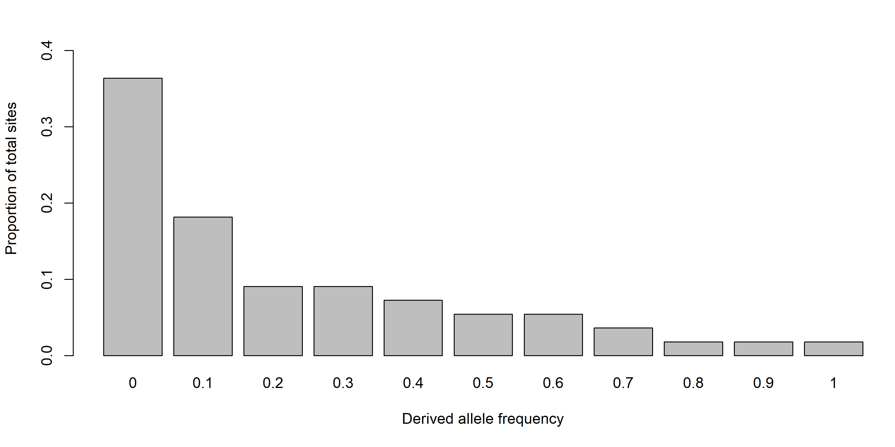
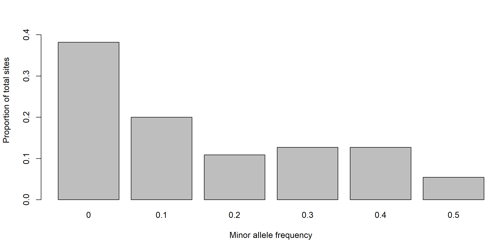
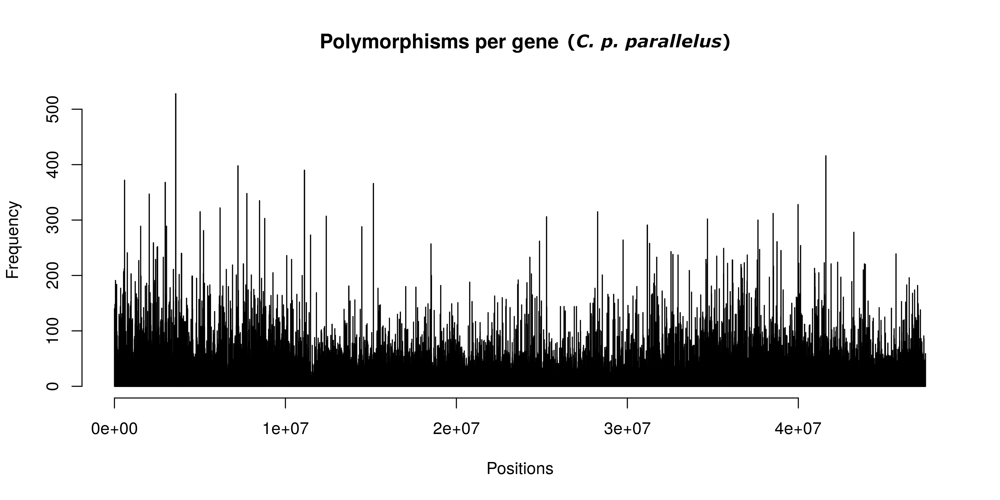

-   [Site Frequency Spectra](#site-frequency-spectra)
    -   [2D Site Frequency Spectrum](#d-site-frequency-spectrum)
-   [Building SFS](#building-sfs)
    -   [Dealing with linkage](#dealing-with-linkage)
        -   [Bootstrapping](#bootstrapping)
    -   [Building 2D SFS](#building-2d-sfs)
        -   [Creating SAF files](#creating-saf-files)
        -   [Building 2D SFS from SAF files](#building-2d-sfs-from-saf-files)
-   [References](#references)

Site Frequency Spectra
======================

A site frequency spectrum (SFS) is a summary statistic used to describe the distribution of allele frequencies in a sample. The distribution of these frequencies can be used to infer various demographic parameters for a population, and forms the main input for our demographic analyses. SFS can be made not only for a sample of one population, but for multiple, illustrating how allele frequencies are distributed between the populations. For this manuscript, we use two population SFS (2D SFS) to fit our demographic models.

SFS are built using biallelic sites within a population, counting the distribution of frequencies of the derived allele in the sample. For example, in a sample of five diploid individuals there are 10 possible alleles (2 for each individual). For each site, we determine the proportion of derived alleles, producing a distribution of these proportions. This distribution is our SFS, and can be displayed as a vector or a histogram. For example, in this 5 individual population, we would have 11 possible states from 0 derived alleles in the sample to 10. If we have 55 sites, the counts might distributed something like this: \[20,10,5,5,4,3,3,2,1,1,1\] and could be visualized in bar plot like the one below, which normalizes the counts by the total number of sites:

In some cases, we don't know which allele at a site is ancestral and which is derived. In this case, we fold the spectrum, essentially combining counts on opposite sides of the spectrum, giving us a minor allele frequency. In our example above, we had 20 sites where there were 0 derived alleles in the sample and 1 where there was 10. If we don't know the identity of the derived allele, these both hold the same information: a site where all alleles are the same, meaning we have 21 sites with a minor allele frequency of 0. This gives us a folded SFS of \[21,11,6,7,7,3\] which is visualized below:

2D Site Frequency Spectrum
--------------------------

When comparing two populations, a 2D SFS can be built, which associates the allele frequencies of two populations with each other. This can also use derived allele frequency or be folded to use minor allele frequencies.

Building SFS
============

Dealing with linkage
--------------------

Because demographic models in dadi consider every site as an independent measurement, linkage can skew the results of your demographic analysis when using whole genome or transcriptome data. Sites within the same gene will tend to show the same demographic trends as each other, and this makes these sites non-independent.

Take for instance 5 genes. Gene 1 contains 500 sites, and genes 2, 3, 4, and 5 contain 100 sites each. Say gene 1 shows gene flow from population 1 to 2, whereas the four other genes show gene flow form population 2 to 1; in this case 500/900 sites show evidence of gene flow from population 1 to 2, but only 1/5 genes show this same trend. This is due to the non-independence of linked sites.

To see if we would run into this problem, we plot polymorphisms per gene in *P. p. parallelus*. We found that polymorphism counts vary considerably between genes, meaning linkage could skew demographic analysis results:

To resolve this, we produced bootstrapped datasets by resamling the genes within our SFS with replacement into 100 bootstrapped SFS.

### Bootstrapping

In this project, we use non-parametric bootstraps, which are SFS produced by sampling genes with replacement. To do this, instead of building a single, whole genome SFS, we built a single SFS for each gene. The dataset is the sum of these SFS (as the SFS is merely a vector). To build a bootstrap, we randomly resampled gene SFS with replacement until we had a bootstrap SFS with the same number of genes as our dataset.

For example, say you have five genes in total, and thus a five gene SFS. Your dataset SFS would be gene 1+2+3+4+5, but your bootstrap SFS would be a random resampling with replacement of five gene SFS, for instance 2+4+3+5+5 or 1+1+1+3+5. What this does is produces SFS that exacerbate the effects of linkage in some genes and diminish the effects in others, and when this is done randomly for many bootstraps, we can calculate how much linkage is skewing our models.

Building 2D SFS
---------------

Building a 2D SFS with ANGSD using genotype likelihoods is relatively easy, but we must take into account that we will want to bootstrap this SFS later on (see [Bootstrapping section in the ∂a∂i readme](../dadi)). The best way to do this is to build SFS for individual genes that can be later sampled to build bootstraps.

To do this in ANGSD, we build a SAF file, then build individual gene SFS from that SAF file.

#### Creating SAF files

SAF files are large files that contain information on the allele frequencies of your sample. One will need to be made separately for each population you intend to examine. Which individuals will be included in the SAF file is determined by the bamlist.

##### SAF command and SLURM script

Due to the time and memory use required to build a SAF file, these are best submitted as batch jobs to a high powered cluster. Below is an example script ([crub\_p1\_fold0.sh](slurm_scripts/crub_p1_fold.sh)) for submission to LRZ.

    #!/bin/bash
    #SBATCH -J crub_p1_fold0
    #SBATCH --output=slurm_scripts/crub_p1_fold0.out
    #SBATCH --partition=mpp2_batch
    #SBATCH --clusters=mpp2
    #SBATCH --cpus-per-task=1
    #SBATCH -t 48:00:00

    STARTTIME=$(date +"%s")

    angsd -b lrz_crub.bamlist -ref grasshopperRef.fasta -anc grasshopperRef.fasta -doSaf 1 -doCounts 1 -DoMaf 1 -doMajorMinor 1 -GL 1 -r chr1: -sites neutral_sites -minInd 12 -minMapQ 15 -only_proper_pairs 0 -minQ 20 -remove_bads 1 -uniqueOnly 1 -C 50 -baq 1 -setMinDepth 32 -fold 0 -SNP_pval 1 -out saf/crub_p1_fold0

    ENDTIME=$(date +%s)
    TIMESPEND=$(($ENDTIME - $STARTTIME))
    ((sec=TIMESPEND%60,TIMESPEND/=60, min=TIMESPEND%60, hrs=TIMESPEND/60))
    timestamp=$(printf "%d:%02d:%02d" $hrs $min $sec)
    echo "Took $timestamp hours:minutes:seconds to complete..."

###### SAF file command line options

See [General ANGSD Options](..) at the beginning of the supplementary materials for options not mentioned below.

<table>
<colgroup>
<col width="46%" />
<col width="54%" />
</colgroup>
<thead>
<tr class="header">
<th>Option</th>
<th>Description</th>
</tr>
</thead>
<tbody>
<tr class="odd">
<td><code>-anc ../input_files/grasshopperRef.fasta</code></td>
<td>A fasta file containing the outgroup you will determine ancestral and derived states from. For the Biguttulus group, we use the <em>C. parallelus</em> reference. For the Parallelus group, we built a <a href="../input_files/grasshopperRef_cmol.fasta"><em>C. mollis</em> reference</a>. Ultimately, we only used folded SFS in our analyses, so this polarization does not matter for our results.</td>
</tr>
<tr class="even">
<td><code>-doSaf 1</code></td>
<td>Setting to 1 indicates that allele frequency likelihoods will be determined by individual genotype likelihoods assuming Hardy-Weinberg Equilibrium.</td>
</tr>
<tr class="odd">
<td><code>-fold 0</code></td>
<td>Determines whether your SFS will be unfolded (0) or folded (1). If you are not confident in the ancestral states defined by your outgroup, it may be best to fold. However, for SAF file production, we always left our SFS unfolded, as they can easily be folded later.</td>
</tr>
<tr class="even">
<td><code>SNP_pval 1</code></td>
<td>This defines the intensity of filtering on SNPs in your SAF file. A p-value of 1 indicates including all sites, including sites with no polymorphisms. Lowering the value increasingly removes fixed sites and low frequency SNPs. We do not need to filter out fixed sites in this case, as we are not sampling, and fixed sites will be removed in the demographic analyses automatically.</td>
</tr>
</tbody>
</table>

#### Building 2D SFS from SAF files

To build an SFS that can be bootstrapped, it is best to build an SFS for each gene, and sum these together for the final SFS. This allows resampling of gene SFS for bootstrapping.

Building an SFS with ANGSD uses a single command that runs in a few seconds:

`realSFS saf/cppar_p1_fold0_ancmol.saf.idx saf/cpery_fold0_ancmol.saf.idx -r chr1:1-9898 -P 1 > sfs/per_gene_sfs/cppar_cpery/2dsfs_cppar_cpery_p1_fold0_chr1:1-9898.sfs`

The realSFS command is built into ANGSD and takes two SAF files as input: the SAF of population 1 and the SAF of population 2, in order. The option `-r` restricts it to a single region of the genome, here, we restrict it to the first gene, making an SFS for this gene only. `-P` determines the number of threads to be used in the calculation. After the `>` we give the output sfs a filename and location.

The format of the file is a single vector of numbers. We have built a bash script that iterates over all our species comparisons and builds all possible per gene SFS for each comparison, [`calc_gene_sfs.sh`](calc_gene_sfs.sh). At the end of the script, it removes any empty SFS that would be built from genes where both species have no data.

Building the final SFS is simply a matter of summing all the gene SFS into a single vector, the complete SFS. However, to be readable by ∂a∂i, a header will need to be input of a single line containing the dimensions of the SFS, whether the SFS is folded or unfolded, and the names of population 1 and population 2. For cppar\_cpery, the header would look like this:

`11 11 unfolded "cppar" "cpery"`

The dimensions are the number of individuals in each population, doubled, then plus one as explained in the introduction to SFS at the beginning of this readme (the 11 possible states in the 1D SFS).

We have built an R script ([`build\_gl\_boots.R`](build_gl_boots.R)) that sums all gene SFS into a single SFS with the suffix 'genesum', which is then used as the dataset for demographic modeling with the SFS. It also builds 100 bootstraps by sampling gene SFS with replacement to build a bootstrapped SFS with the same number of genes as the true genesum SFS. It appends the appropriate header to all these files so that they are ready to be input into ∂a∂i.

References
==========

Gutenkunst, Ryan N., Ryan D. Hernandez, Scott H. Williamson, and Carlos D. Bustamante. 2009. “Inferring the Joint Demographic History of Multiple Populations from Multidimensional SNP Frequency Data.” *PLOS Genetics* 5 (10): e1000695. doi:[10.1371/journal.pgen.1000695](https://doi.org/10.1371/journal.pgen.1000695).

Korneliussen, Thorfinn Sand, Anders Albrechtsen, and Rasmus Nielsen. 2014. “ANGSD: Analysis of Next Generation Sequencing Data.” *BMC Bioinformatics* 15 (1): 356. doi:[10.1186/s12859-014-0356-4](https://doi.org/10.1186/s12859-014-0356-4).
